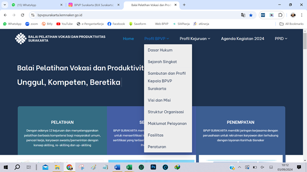
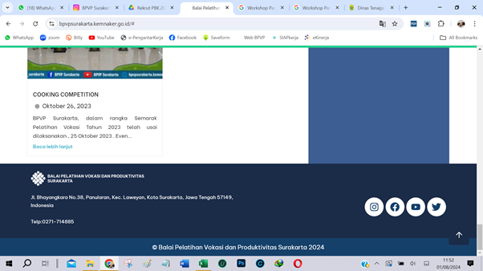
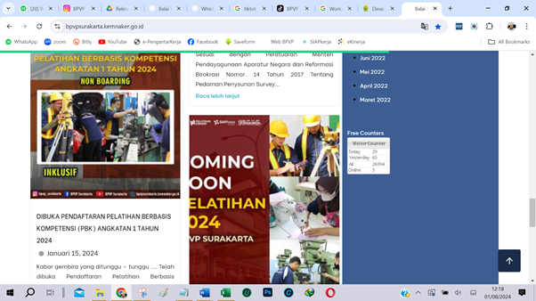
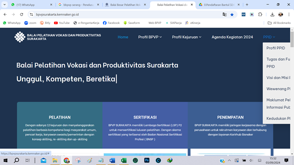
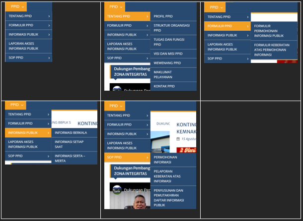

1.	Perlu ditambahkan sub menu “Tugas dan Fungsi” di menu dropdown Profil BPVP (diatas Visi & Misi)

 
Narasi Tugas dan Fungsi :
TUGAS DAN FUNGSI BPVP SURAKARTA 
SEBAGAI BALAI PELATIHAN VOKASI DAN PRODUKTIVITAS KELAS I

Peraturan Menteri Ketenagakerjaan Republik Indonesia Nomor 1 Tahun 2022 tentang Organisasi dan Tata Kerja Unit Pelaksana Teknis di Kementerian Ketenagakerjaan, 

Pasal 11
Balai Pelatihan Vokasi dan Produktivitas Kelas I mempunyai TUGAS tugas melaksanakan pelatihan vokasi dan peningkatan produktivitas, sertifikasi kompetensi, serta konsultansi dan peningkatan jejaring di bidang pelatihan vokasi dan produktivitas.

Pasal 12
Balai Pelatihan Vokasi dan Produktivitas Kelas I menyelenggarakan FUNGSI: 
a.	penyusunan rencana, program dan anggaran; 
b.	pelaksanaan pelatihan vokasi dan peningkatan produktivitas; 
c.	pelaksanaan fasilitasi pemagangan; 
d.	pelaksanaan sertifikasi kompetensi; 
e.	pelaksanaan konsultansi pelatihan vokasi dan produktivitas; 
f.	pelaksanaan peningkatan jejaring pelatihan vokasi dan produktivitas; 
g.	pelaksanaan promosi dan pengukuran peningkatan produktivitas; cc
h.	pelaksanaan pemantauan pelatihan vokasi dan produktivitas; 
i.	pelaksanaan urusan organisasi dan sumber daya manusia aparatur, tata laksana, keuangan, rumah tangga, persuratan, kearsipan, perlengkapan, dan pengelolaan barang milik negara; dan 
j.	penyusunan evaluasi dan pelaporan. 

----------------------------------------- ooo --------------------------------------------------
 
1.	Logo twiter ganti logo tiktok, link nya ganti juga : www.tiktok.com/@bpvp_surakarta
2.	Kotak merah diganti :
LOKASI
	Kantor Utama
Jl. Bhayangkara No. 38 Surakarta, Jawa Tengah 57149
	Workshop Pariwisata 
Jl. Klengkeng, Kerten, Kec. Laweyan, Surakarta, Jawa Tengah 57143
	Satuan Pelayanan Bantul 
Jl. Parangtritis Km.12,5 Bakulan Kulon, Patalan, Kec. Jetis, Bantul, DIY 55781

----------------------------------------- ooo --------------------------------------------------

 
Pada kotak perlu ditambahkan :
JAM PELAYANAN 
Senin – Kamis 	: Pk. 08.00 – 15.30 WIB
Jumat		: Pk. 08.30 – 14.00

Di bawahnya ditambahkan : 

PERMOHONAN INFORMASI PUBLIK  nge-link ke 

----------------------------------------- ooo --------------------------------------------------

 
Revisi Menu PPID

Dibuat seperti di bawah :
 	 

 	 
	

Kurang info PPID yg seharusnya ada di website :
-	LHKPN
-	Informasi Jumlah Permintaan Informasi Publik 2023 ?
-	Informasi Jumlah Keberatan Informasi Publik 2023 ?
-	Informasi Jumlah Informasi Diberikan pada tahun 2023 ?
-	Informasi yang Ditolak pada 2023 ?
-	Informasi tentang Alasan Penolakan atas Informasi Publik di tahun 2023 ?
-	Informasi Tata Cara Permintaan Informasi (SOP/Flyer) ?
-	Informasi Tata Cara Pengajuan Keberatan (SOP/Flyer) ?
-	Informasi Jadwal Layanan Informasi Publik ?
-	
